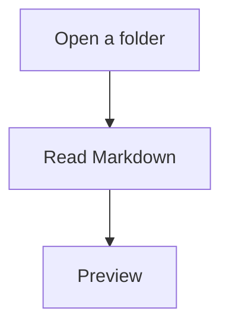

# Mermaid

A `mermaid` fence renders in the preview when the diagram is nearly on screen
(400 px margin). The library loads locally, with no network.

````markdown

````

Click a diagram to open a window: drag the title to move it, resize from the
edges, wheel or icon-zoom (up to 3200%), pan the drawing, Copy SVG, Save PNG
(native save dialog). Size and zoom are stored in `config.json` and restored
the next time you open a diagram.

If the syntax is invalid, a message and the source appear under the block.
The same error is added to the toast in the corner (Dismiss, or it clears
after a few seconds) and to Message history. The rest of the page stays intact.

Finished SVG is cached on disk by source hash and theme id
(`~/.1537paperstreet/cache/mermaid/`). Changing theme redraws the diagram.

Settings can turn Mermaid off. Then you get a short note that diagrams are
disabled instead of a drawing.
